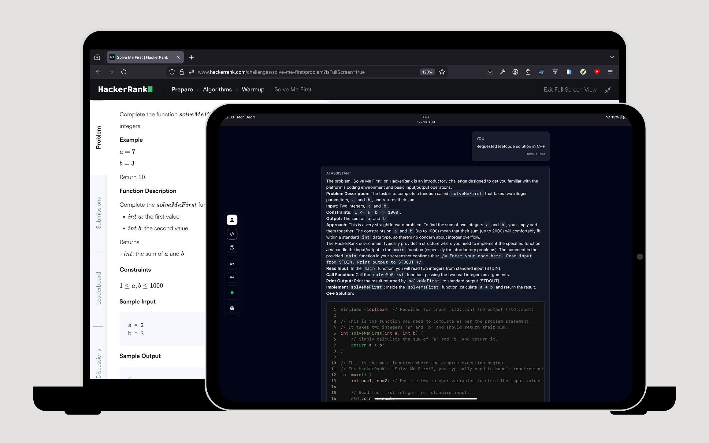
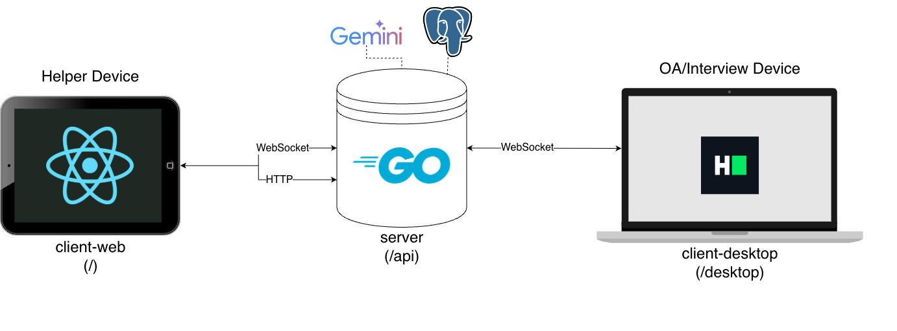

# About




# Web Client

This is main client for helper device.

### Libraries and Tools used:
- [TypeScript](https://www.typescriptlang.org/)
- [Vite](https://vitejs.dev/)
- [React 19.2](https://react.dev/)
- [Redux Toolkit](https://redux-toolkit.js.org/) for state management
- [React Router v7 (data mode)](https://reactrouter.com/start/data/routing) for routing
- [Shadcn UI](https://ui.shadcn.com/) for UI components
- [Tailwind CSS](https://tailwindcss.com/) for styling

## Getting Started

### Setup with Docker

1. Build Image
   ```bash
   docker build -t lambda-client-web .
   ```
2. Run Container
    ```bash
    docker run -p 8888:8888 lambda-client-web
    ```


### Requirements
- [Node.js](https://nodejs.org/) v22 or higher
- [pnpm](https://pnpm.io/) v10 or higher


### Run for development


1. Install dependencies:
   ```bash
   pnpm install
   ```

2. Set up environment variables:
   ```bash
   cp .env.example .env
   ```
   Edit `.env` and adjust `VITE_API_BASE_URL` and `VITE_WS_URL` to point to backend API if different from the default.

3. Start the development server:
   ```bash
   pnpm dev
   ```

### Build for production
1. Install dependencies:
   ```bash
   pnpm install
   ```
2. Build the project:
   ```bash
   pnpm build
   ```
